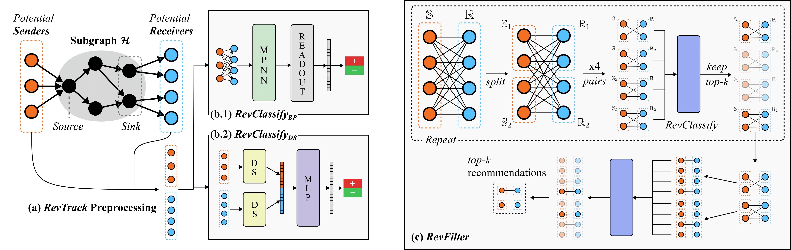

# *RevTrack*: Identifying Money Laundering Subgraphs on the Blockchain

<!-- #### [[Paper]](https://arxiv.org/) -->

Kiwhan Song\*<sup>1,2</sup>, Mohamed Ali Dhraief\*<sup>3</sup>, Muhua Xu<sup>1,2</sup>, Locke Cai<sup>1,2</sup>, Xuhao Chen<sup>1,2</sup>, Arvind<sup>1,2</sup>, Jie Chen<sup>2,4</sup> <br/>
<sup>1</sup>MIT <sup>2</sup>MIT-IBM Watson AI Lab <sup>3</sup>IBM <sup>4</sup>IBM Research <br/>

<!-- This is the official repository for the paper [**_Identifying Money Laundering Subgraphs on the Blockchain_**](https://arxiv.org/). -->
This is the official repository for the paper **_Identifying Money Laundering Subgraphs on the Blockchain_**. We provide the code for *RevTrack*, *RevClassify*, and *RevFilter*, together with the code for the experiments in the paper and model checkpoints. See the instructions below.



<!-- ```
Citation coming soon.
``` -->

## Setup

### Requirements

**Create a new conda environment and install the required packages**:
```bash
conda create python=3.10 -n revtrack
conda activate revtrack
pip install -r requirements.txt
```

### Wandb
We use **[Weights & Biases](https://wandb.ai/site)** for logging and checkpointing. Sign up for a wandb account, run `wandb login` to login, and modify the wandb entity and project in `configurations/config.yaml` to your wandb account and desired project name.

### Dataset

The original [Elliptic2](https://arxiv.org/abs/2404.19109) dataset is available [here](https://www.kaggle.com/datasets/ellipticco/elliptic2-data-set). For the convenience of the users, **we provide a preprocessed version of the dataset placed in the `data/elliptic/raw` directory**. However, we serve node embeddings separately on [Google Drive](https://drive.google.com/file/d/1UBLRxiEg0SK_sWoOWe-55nLOniV9I4HX/view?usp=sharing) due to its large size. **Please download the node embedding file (`raw_emb.pt`) and place it in the `data/elliptic/raw` directory**.


## Pre-trained Model Checkpoints

**All model checkpoints are located in the `checkpoints` directory**. For RevTrack (DS variant), we provide three models each for both finetuned and non-finetuned versions. We also provide three models for each baseline (MLP, NGCF, LightGCN) in the subgraph recommendation task.

## Reproducing Experiments
For running all the experiments in the paper, we use [wandb sweeps](https://docs.wandb.ai/guides/sweeps/), which allows us to search over hyperparameters, or run a set of experiments with different seeds or settings. We used a single V100 GPU for all experiments in the paper.

**For all the experiments, we provide a yaml configuration file in the `configurations/sweep` directory. You can run it using the following command**:
```bash
# Initialize your sweep:
wandb sweep --project <project> --entity <entity> <path_to_yaml_file>
# Your terminal will output a sweep ID.

# Run the sweep by launching the sweep agent:
wandb agent <entity>/<project>/<sweep_id>
# (Launch on multiple terminals to parallelize, if you want)
```

_Note that the YAML files reference our pre-trained model checkpoints in the `checkpoints` directory. If you want to evaluate your own checkpoints, you can modify the `parameters.load.values` field in the YAML files._

### RevTrack
*RevTrack* is an algorithm that identifies potential senders and receivers of each subgraph. The provided dataset is already preprocessed using *RevTrack*, as mentioned above. We will also share the RevTrack preprocessing code soon.

### RevClassify (Subgraph Classification)
We have two variants of *RevClassify*: *RevClassify<sub>BP</sub>* and *RevClassify<sub>DS</sub>*. Test metrics are logged as `final_test/f1` and `final_test/prauc`.

| Task | variant | Sweep YAML File |
|------------|-------------|-------------|
| Hyperparameter Tuning | *RevClassify<sub>BP</sub>* | `configurations/sweep/subgraph_classification/tuning/BP.yaml` |
| Hyperparameter Tuning | *RevClassify<sub>DS</sub>* | `configurations/sweep/subgraph_classification/tuning/DS.yaml` |
| Subgraph Classification (Full-shot)| *RevClassify<sub>BP</sub>* | `configurations/sweep/subgraph_classification/full_shot/BP.yaml` |
| Subgraph Classification (Full-shot) | *RevClassify<sub>DS</sub>* | `configurations/sweep/subgraph_classification/full_shot/DS.yaml` |
| Subgraph Classification (Few-shot)| *RevClassify<sub>BP</sub>* | `configurations/sweep/subgraph_classification/few_shot/BP.yaml` |
| Subgraph Classification (Few-shot) | *RevClassify<sub>DS</sub>* | `configurations/sweep/subgraph_classification/few_shot/DS.yaml` |

### RevFilter (Subgraph Recommendation)
We have four experiments for evaluating *RevFilter*. Each experiment has a corresponding folder with sweep yaml files. The test metrics are logged as `final_test/HR` and `final_test/NDCG`.

| Task | Sweep YAML Files |
|------------|--------------|
| Baseline comparison on multiple settings |`configurations/sweep/subgraph_recommendation/multisettings/{RevFilter, MLP, NGCF, LightGCN}.yaml` |
| Studying the impact of sparsity | `configurations/sweep/subgraph_recommendation/sparsity/{RevFilter, MLP, NGCF, LightGCN}.yaml` |
| Studying the impact of $k$| `configurations/sweep/subgraph_recommendation/top_k/{RevFilter, MLP, NGCF, LightGCN}.yaml` |
| Ablation study | `configurations/sweep/subgraph_recommendation/ablations/{default, no_finetuning, no_iter, no_keep_mult.yaml}` |

## RevFilter: Quick Commands for Training and Evaluation
### Pre-training
```bash
python -m main +name=RevFilter_pretrain dataset=elliptic_recommendation algorithm=iterative_filtering experiment=exp_edge_recommendation 'experiment.tasks=[training]' experiment.validation.test_during_training=False
```

### Fine-tuning
```bash
python -m main +name=RevFilter_finetune dataset=elliptic_recommendation algorithm=iterative_filtering experiment=exp_edge_recommendation 'experiment.tasks=[training]' experiment.training.early_stopping.enabled=False experiment.validation.test_during_training=False experiment.training.max_epochs=300 dataset.augment.enabled=True seed=0 load=<your_pretrained_wandb_id or checkpoints/RevTrack/0.ckpt>
```

### Evaluation
```bash
python -m main +name=RevFilter_eval dataset=elliptic_recommendation algorithm=iterative_filtering experiment=exp_edge_recommendation 'experiment.tasks=[test]' experiment.test.batch_size=16 seed=0 load=<your_finetuned_wandb_id or checkpoints/RevTrack/0_tuned.ckpt> +shortcut=<your_setting>
# your_setting should be formatted as: a+b@k e.g., 10+1000@100
```

# Acknowledgements
**This research was sponsored by MIT-IBM Watson AI Lab.**

**This repo is forked from [Boyuan Chen](https://boyuan.space/)'s research template [repo](https://github.com/buoyancy99/research-template).** _By its MIT license, you must keep the above sentence in `README.md` and the `LICENSE` file to credit the author. By directly reading the template repo's `README.md`, you can learn how this repo is structured and how to use it._
